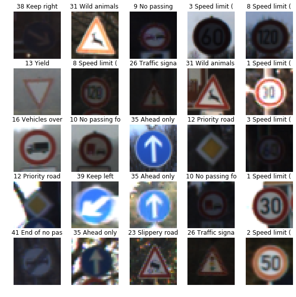
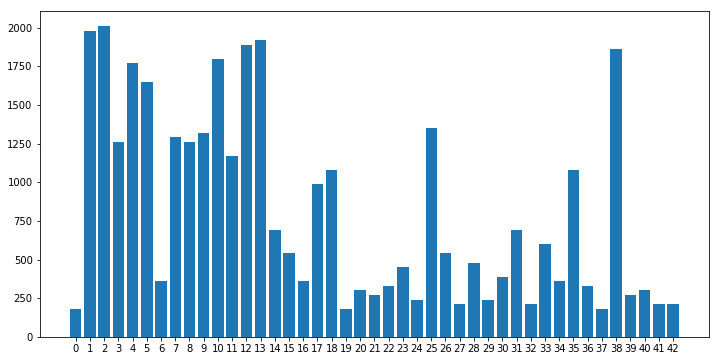
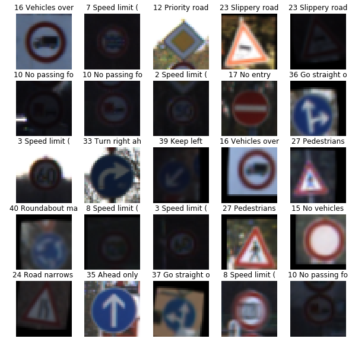
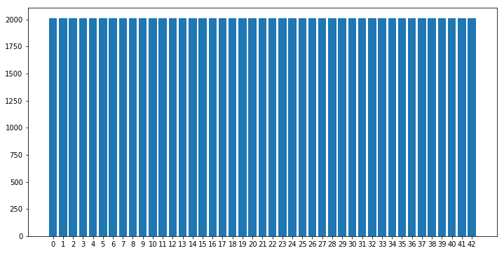
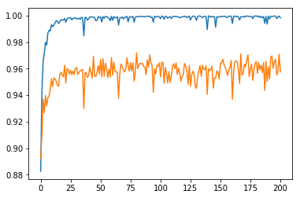
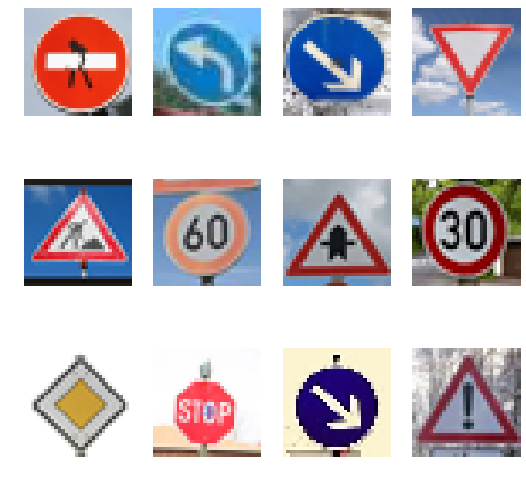
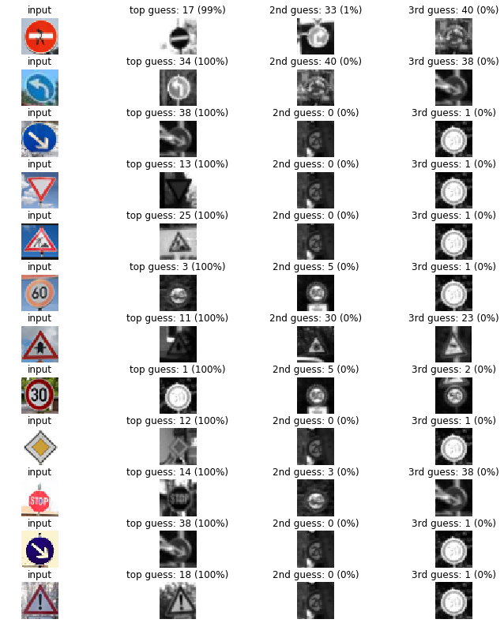
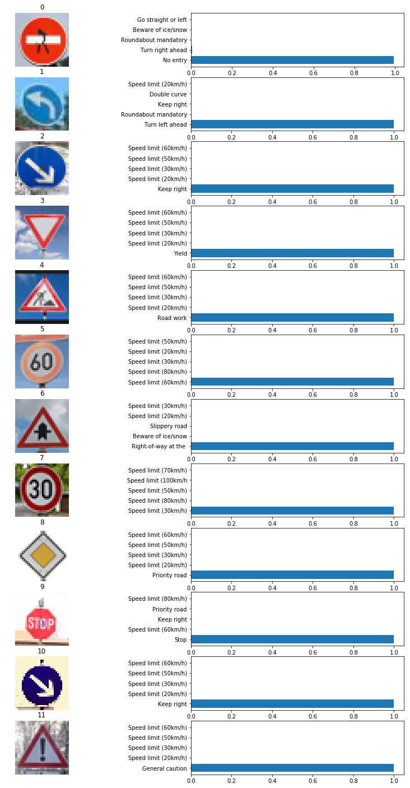
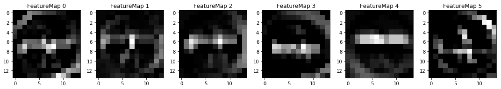
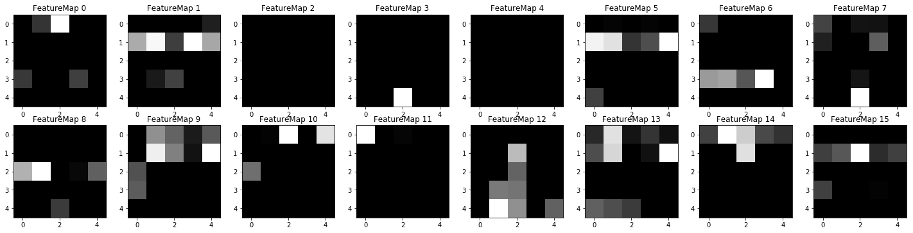

## Project: Build a Traffic Sign Recognition Program
[](http://www.udacity.com/drive)

Overview
---
In this project, I used what I've learned about deep neural networks and convolutional neural networks to classify traffic signs. I trained and validated a model so it can classify traffic sign images using the [German Traffic Sign Dataset](http://benchmark.ini.rub.de/?section=gtsrb&subsection=dataset). After the model is trained, I try out my model on images of German traffic signs that I find on the web.

The steps of this project are listed below. You can have a look at [Traffic_Sign_Classifier.ipynb](./Traffic_Sign_Classifier.ipynb) for the code.

To meet specifications, the project will require submitting three files: 
* the Ipython notebook with the code
* the code exported as an html file
* a writeup report either as a markdown or pdf file 


The Project
---
The goals / steps of this project are the following:
* Load the data set
* Explore, summarize and visualize the data set
* Design, train and test a model architecture
* Use the model to make predictions on new images
* Analyze the softmax probabilities of the new images
* Summarize the results with a written report

Dependencies
---
This project requires Python 3.5 and the following Python libraries installed:

* Jupyter
* NumPy
* SciPy
* scikit-learn
* TensorFlow
* Matplotlib
* Pandas (Optional)

Run this command at the terminal prompt to install OpenCV. Useful for image processing:

```
conda install -c https://conda.anaconda.org/menpo opencv3
```

Data Set Summary & Exploration
---
__1. Basic summary of the data set.
In order to calculate summary statistics for the data set, I used numpy library. The results are as follows:__

* The size of training set is 34799 images.
* The size of the validation set is 4410 images.
* The size of test set is 12630 images.
* The shape of a traffic sign image is 32x32x3. This means that each picture is 32 pixels wide, 32 pixels tall, and has 3 color channels.
* The number of unique classes/labels in the data set is 43.

__2. Exploratory visualization of the dataset.__

I plot some traffic signs randomly. As you can see from the images below, the lighting conditions under which the phtos were taken vary drastically. Some of the photos are hard to tell apart because the lighting was too dark. This can be a big challenge to train the network.



Also the number of training examples for each class varies. The histogram showing the number of training examples for each class. The imbalance data set is another thing need to be fixed. In order to solve this issue, I balanced the classes in such a way that all of them have equal number of images.



Design and Test a Model Architecture
---
__1. Image preprocessing.__
* Normalization:
Normalizing all pictures  by substracting mean value and dividing by the standard deviation of the mean value. This normalization was performed for each of 3 of the color channels. (This approach was inspired by the [VGG19](https://arxiv.org/pdf/1409.1556.pdf) paper)
An important consideration was data leakage, so the mean and SD values used for all normalization were calculated only based on the training data set, and not validation or test data.

* Augmentation:
To make class balance, I used CV2 package to rotation, translation and shear to generate new images. Resulting transformed images can be seen below.

* Converting to grayscale for ConvNet
This worked well for ConvNet as described in their traffic sign classification article. It also helps to reduce training time, which was nice when a GPU wasn't fast enough.



After augmentation/balancing, each class has 2010 images, which is how many images the largest class had before augmentation.



__2. Model architecture.__
The first model I used is LeNet-5 Model

__LeNet-5 Model Architecture__

[LeNet-5 [1998, paper by LeCun et al.]](http://yann.lecun.com/exdb/publis/pdf/sermanet-ijcnn-11.pdf)


As described in VGG19, the network learn the best color channel combination by having 3 1X1 convolution chanels in first layer. The original RGB color scheme sometimes is not the best for deep learing. We can make a network learn from itself, this can also improve accuracy.

About max pooling layers, the first convolutional layer (1x1 doesn't count) doesn't have max pooling, whereas the other two do have 2x2 max pooling. You may ask why, and the answer has to do with dimesionality reduction. Had I used max pooling after first layer, the output from which has 30x30 spacial dimansion, and after max pooling that would be 15x15, which after next convolutional layer would be 13x13, at which point 2x2 max pooling cannot be applied. This means I needed to plan convolutional and max pooling layers in such a fashion that all corresponding input-output spacial dimensions are even number of pixels.

After training the model, the results of LeNet-5 were:
- training set accuracy of 0.959
- validation set accuracy of 0.947
- test set accuracy of 0.917

The accuracy wasn't as high as I expected and the training time is too lang due to my GPU wasn't fast enough. So I try the ConvNet model for better result and less training time.


__ConvNet Model Architecture__

[ConvNet [traffic sign classification journal article 2011, paper by Sermanet/LeCunn.]](http://yann.lecun.com/exdb/publis/pdf/sermanet-ijcnn-11.pdf)


I implemented the ConvNet model from their traffic sign classifier paper and saw an immediate improvement. Although the paper doesn't go into detail describing exactly how the model is implemented (particularly the depth of the layers) But it works. The layers are set up like this:

| Layers | Description |
|--------|-------------|
|5x5 convolution|32x32x1 in, 28x28x6 out|
|ReLU||
|2x2 max pool|28x28x6 in, 14x14x6 out|
|5x5 convolution|14x14x6 in, 10x10x16 out|
|ReLU||
|2x2 max pool|10x10x16 in, 5x5x16 out|
|5x5 convolution|5x5x6 in, 1x1x400 out|
|ReLu|
|Flatten layers| from numbers 8 (1x1x400 -> 400) and 6 (5x5x16 -> 400) |
|Concatenate| flattened layers to a single size-800 layer|
|Dropout layer|
|Fully connected layer | 800 in, 43 out|

__3. Training the model.__

To train the model, I made the following decisions:

* Adam optimizer. Adam optimizer uses adaptive decrease of the learning rate. It is quite useful, as it allows the optimizing algorithm to slow down as it approaches solution.
* Starting learning rate of 0.0009. This choice was motivated by trial and error and also by looking at what practitioners use for this type of optimizer.
* Batch size of 32. My memory wasn't big enough. I was getting out of memory errors when trying to make this value larger, so I decided to stop at 32.
* Number of epochs was 201. Since one epoch trained relatively fast (13 seconds on average), I could afford to run it for longer and see if it converges to some value (which it did).
* Use Numba, a JIT compiler, to make Python code fast.


__4. Finding the final solution.__

In the graph below, the blue line represents training accuracy and the orange line represents validation accuracy. In the beginning of the training, validation accuracy is higher than training accuracy. This is the result of using dropout. This reduces training accuracy and prevents overfitting. Using dropout additionally reduces the gap between training and validation accuracy, which is good. On the downside, training requires more epochs to converge.



After training the model for 201 epochs, the final results were:

* training set accuracy of 0.999
* validation set accuracy of 0.974
* test set accuracy of 0.946

During this project, I have tried some architectures and encountered numerous challenges. Unfortunately, I did not keep a log of all approaches that I tried.

In the begining, I tried the LeNet architecture. I chose it because, both MNIST digits data set and traffic signs are similar in complexity. Both have simple fatures that distinguish classes. But the accuracy is not as high as I expected and the runing time is long due to my GPU is not fast enough.

Then I tried the ConvNet architecture which is also LeCun's model. The main reason is the images were grayscale. This worked well for Sermanet and LeCun as described in their traffic sign classification article. It also helps to reduce training time, which was nice when my GPU was slow. The classes of Tensorflow and LeNet labs help a lot when I have to use rial and error approach. Beside this, the Deep Learing course of Andrew Ng helped me to tune the hyperparameters to get a good level of validation accuracy.

Test a Model on New Images
---
__1. New German traffic signs.__

Here are 12 German traffic signs that I found on the web:



__2. Model's predictions on the new traffic signs.__

All the photos should be distinguished easily, cause none of them were taken in low light conditions. And the result is as good as I expected, with 100% accuracy. This is a good sign as the model performs well on real-world data. But we can assume that the accuracy could not remain so high by given more data points if the image isn't as bright as the new images.

__3. Softmax probabilities for all new signs.__

Results can be seen in the figure below.





__4 (Optional): Visualize the Neural Network's State with Test Images__

-Featuremap of conv1 Layer, the shape of this layer is 14x14x6 and this featuremap is for stop sign at the next Intersection sign class.

-Featuremap for Pooling layer which is having output shape of 14x14x6.


-Featuremap for Pooling layer which is having output shape of 5x5x16.

